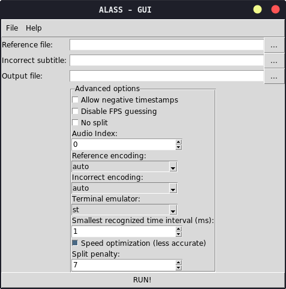

# ALASS GUI

A shitty tkinter wrapper around the very awesome [Automatic Language-Agnostic Subtitle Synchronization (Command Line Tool)](https://github.com/kaegi/alass)

The reference file can either be a subtitle or a video file. If a video file is specified, alass will use voice activity detection on the choosen audio track of the video to align the subtitles.
